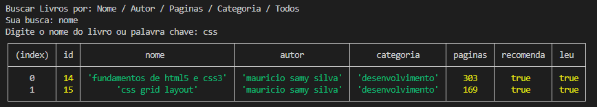
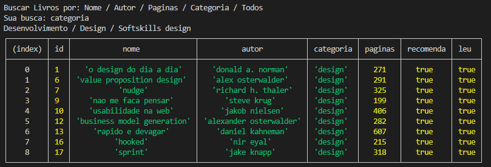
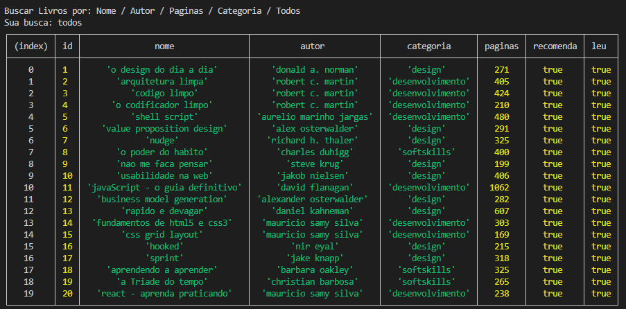

# Mecanismo de Busca de Livros - Gama Academy - XP 44 🚀

## Sobre a Gama Academy 🏫

<br>

Empresa de educação que prepara talentos para o mercado digital. Em seus programas educacionais, as pessoas participantes enfrentam desafios reais, se conectam com empresas digitais, recebem mentorias de profissionais que estão mandando bem em suas áreas e, ainda têm a oportunidade de ensinar e aprender com a nossa comunidade visando o emprego, transição de carreira e o life long learning.

<br>

## Sobre o Gama Experience 👨🏽‍💻

<br>

É um curso com duração de 6 meses, com o objetivo de formar os melhores juniores do mercado, nas áreas de Desenvolvimento Web e Designers UX/UI! A primeira versão do curso foi lançada pela Gama Academy em 2016 e já empregou mais de 3.000 pessoas.  A versão atual contém mais de 810 horas de aulas, desafios e mentorias, com foco na  empregabilidade de nossos estudantes!

<br>

## Sobre o Exercício ✔️

<br>

A atividade consiste em criar um mecanismo de pesquisa de livros em um banco de dados. O arquivo database.js simula um arquivo .json para exportação de um array de objetos descrevendo alguns livros. As pesquisas são realizadas utilizando como dados o nome, autor, número de páginas e categoria de livros. Para isso foram utilizadas as seguintes ferramentas e conteúdos:

<br>

* JavaScript;
* Node;
* Template Literals;
* Arrow Function;
* ReadLine-Sync.

<br>

## Execução 📋

<br>

* Clone este repositório remoto em seu equipamento:
```
git@github.com:DuAlexandre/busca-livros-gama-xp44.git
```

* Instale as dependências do ReadLine-Sync:
```
npm i readline-sync
```
* Inicie o programa:
```
npm start
```
* Selecione o tipo de pesquisa:
```
nome
- Pesquisa nome de um livro ou palavra chave em seu título.
```
```
autor
- Pesquisa nome de um autor ou parte do nome como palavra chave.
```
```
paginas
- Pesquisa limitando ao número máximo escolhido de páginas.
```
```
categoria
- Pesquisa por categoria de livros;
-Sub-pesquisa: desenvolvimento, design ou softskills.
```
```
todos
- Mostra todos os livros do banco de dados.
```

<br>

## Prints de execução 📷

<br>



<br>



<br>

